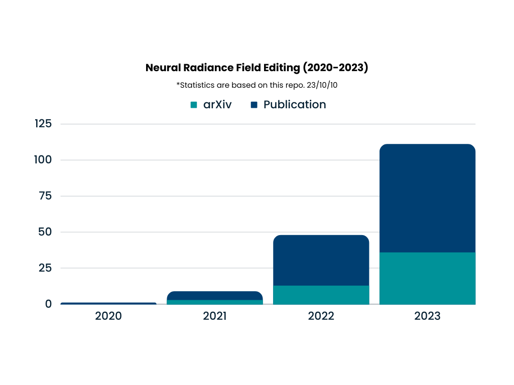

# Awesome Neural Radiance Field (NeRF) Editing 

Welcome to **awesome-nerf-editing**🧙🏻‍♂️, your ultimate resource for exploring the exciting world of Neural Radiance Field (NeRF) editing! NeRF is revolutionizing computer vision and 3D graphics, and this curated collection of resources is your gateway to understanding and mastering NeRF-based editing techniques. Whether you're a researcher, developer, or simply curious about the cutting-edge applications of NeRF, you'll find a wealth of valuable information here.  

## 🪬What is NeRF Editing?
NeRF Editing leverages the power of Neural Radiance Fields to manipulate and edit 3D scenes or objects in a highly realistic and immersive manner. This emerging field holds immense potential for a wide range of applications, including virtual reality, augmented reality, content creation, and more. **However, neural radiance field implicitly encode shape and texture information of the scene or object, which implies natural difficulties in the NeRF editing task.**

  

## 😶‍🌫️Why "awesome-nerf-editing"?
+ Comprehensive Resources: We've curated an extensive list of papers and projects related to NeRF editing, making it easy for you to dive into this exciting field.
+ Community Collaboration: Join our community of NeRF researchers, and developers. Share your insights, ask questions, and collaborate on groundbreaking projects.
+ Stay Updated: We keep our resources up-to-date, ensuring that you're always at the forefront of NeRF research and development.

## Recent Research [Latest Update: 2023/11/09☕] 

🚨 Note: Please be aware that the acceptance status of some works might not be up-to-date. 📝💡     

👋 Feel Welcome to Open an Issue or Pull Request! 🚀💬

+ **2024**
  - [WACV 2024] [Fast Sun-aligned Outdoor Scene Relighting based on TensoRF](https://arxiv.org/abs/2311.03965)
  - [WACV 2024] [Open-NeRF: Towards Open Vocabulary NeRF Decomposition](https://arxiv.org/abs/2310.16383)
  - [3DV 2024] [Single-view 3D Scene Reconstruction with High-fidelity Shape and Texture](https://arxiv.org/abs/2311.00457) 丨 [[Project Page]](https://dali-jack.github.io/SSR/)
  - [3DV 2024] [Text-Guided Generation and Editing of Compositional 3D Avatars](https://arxiv.org/abs/2309.07125) 丨 [[Project Page]](https://prior.allenai.org/projects/object-edit)
  - [3DV 2024] [Learning Controllable 3D Diffusion Models from Single-view Images](https://arxiv.org/abs/2304.06700) 丨 [[Project Page]](https://jiataogu.me/control3diff/)
  - [3DV 2024] [Compositional 3D Scene Generation using Locally Conditioned Diffusion](https://arxiv.org/abs/2303.12218) | [[Project Page]](https://ryanpo.com/comp3d/)
  - [3DV 2024] [Consistent-1-to-3: Consistent Image to 3D View Synthesis via Geometry-aware Diffusion Models](https://arxiv.org/abs/2310.03020) | [[Project Page]](https://jianglongye.com/consistent123/)
+ **2023**
  - [NeurIPS 2023] [UE4-NeRF:Neural Radiance Field for Real-Time Rendering of Large-Scale Scene](https://arxiv.org/abs/2310.13263) | [[Project Page]](https://jamchaos.github.io/UE4-NeRF/)
  - [NeurIPS 2023] [FDNeRF: Semantics-Driven Face Reconstruction, Prompt Editing and Relighting with Diffusion Models](https://arxiv.org/abs/2306.00783) 丨 [[Project Page]](https://github.com/BillyXYB/FDNeRF)
  - [NeurIPS 2023] [OBJect 3DIT: Language-guided 3D-aware Image Editing](http://arxiv.org/abs/2307.11073) 丨 [[Project Page]](https://prior.allenai.org/projects/object-edit)
  - [CICAI 2023 Best Paper Runner-up] [MARS: An Instance-aware, Modular and Realistic Simulator for Autonomous Driving](https://arxiv.org/abs/2307.15058) 丨 [[Project Page]](https://open-air-sun.github.io/mars/)
  - [ICCV 2023 Oral] [ENVIDR: Implicit Differentiable Renderer with Neural Environment Lighting](https://arxiv.org/abs/2303.13022) 丨 [[Project Page]](https://nexuslrf.github.io/ENVIDR/)
  - [ICCV 2023 Oral] [Instruct-NeRF2NeRF: Editing 3D Scenes with Instructions](https://arxiv.org/abs/2303.12789) 丨 [[Project Page]](https://instruct-nerf2nerf.github.io/)
  - [ICCV 2023] [UrbanGIRAFFE: Representing Urban Scenes as Compositional Generative Neural Feature Fields](https://arxiv.org/abs/2303.14167) 丨 [[Project Page]](https://github.com/freemty/UrbanGIRAFFE)
  - [ICCV 2023] [Clutter Detection and Removal in 3D Scenes with View-Consistent Inpainting](https://arxiv.org/abs/2304.03763) 丨 [[Project Page]](https://weify627.github.io/clutter/)
  - [ICCV 2023] [ICE-NeRF: Interactive Color Editing of NeRFs via Decomposition-Aware Weight Optimization](https://openaccess.thecvf.com//content/ICCV2023/html/Lee_ICE-NeRF_Interactive_Color_Editing_of_NeRFs_via_Decomposition-Aware_Weight_Optimization_ICCV_2023_paper.html) 
  - [ICCV 2023] [ReNeRF: Relightable Neural Radiance Fields with Nearfield Lighting](https://openaccess.thecvf.com/content/ICCV2023/html/Xu_ReNeRF_Relightable_Neural_Radiance_Fields_with_Nearfield_Lighting_ICCV_2023_paper.html) 
  - [ICCV 2023] [3D-aware Blending with Generative NeRFs](https://arxiv.org/abs/2302.06608) 丨 [[Project Page]](https://blandocs.github.io/blendnerf)
  - [ICCV 2023] [Vox-E: Text-guided Voxel Editing of 3D Objects](https://arxiv.org/abs/2303.12048) 丨 [[Project Page]](https://tau-vailab.github.io/Vox-E/)
  - [ICCV 2023] [3D Semantic Subspace Traverser: Empowering 3D Generative Model with Shape Editing Capability](https://arxiv.org/abs/2307.14051) 丨 [[Project Page]](https://github.com/TrepangCat/3D_Semantic_Subspace_Traverser)
  - [ICCV 2023] [Urban Radiance Field Representation with Deformable Neural Mesh Primitives](https://arxiv.org/abs/2307.10776) 丨 [[Project Page]](https://dnmp.github.io/)
  - [ICCV 2023] [DeformToon3D: Deformable 3D Toonification from Neural Radiance Fields](https://arxiv.org/abs/2309.04410) 丨 [[Project Page]](https://www.mmlab-ntu.com/project/deformtoon3d/)
  - [ICCV 2023] [Learning Neural Implicit Surfaces with Object-Aware Radiance Fields](https://openaccess.thecvf.com//content/ICCV2023/html/Zhang_Learning_Neural_Implicit_Surfaces_with_Object-Aware_Radiance_Fields_ICCV_2023_paper.html) 
  - [ICCV 2023] [X-Mesh:Towards Fast and Accurate Text-driven 3D Stylization via Dynamic Textual Guidance](https://arxiv.org/abs/2303.15764) 丨 [[Project Page]](https://xmu-xiaoma666.github.io/Projects/X-Mesh/)
  - [ICCV 2023] [Towards High-Fidelity Text-Guided 3D Face Generation and Manipulation Using only Images](https://arxiv.org/abs/2308.16758) 
  - [ICCV 2023] [DreamBooth3D: Subject-Driven Text-to-3D Generation](https://arxiv.org/abs/2303.13508) 丨 [[Project Page]](https://dreambooth3d.github.io/)
  - [ICCV 2023] [Single-Stage Diffusion NeRF: A Unified Approach to 3D Generation and Reconstruction](https://arxiv.org/abs/2304.06714) 丨 [[Project Page]](https://lakonik.github.io/ssdnerf/)
  - [ICCV 2023] [Delicate Textured Mesh Recovery from NeRF via Adaptive Surface Refinement](https://arxiv.org/abs/2303.02091) 丨 [[Project Page]](https://me.kiui.moe/nerf2mesh/)
  - [ICCV 2023] [Locally Stylized Neural Radiance Fields](https://arxiv.org/abs/2309.10684)
  - [ICCV 2023] [CC3D: Layout-Conditioned Generation of Compositional 3D Scenes](https://arxiv.org/abs/2303.12074) 丨 [[Project Page]](https://sherwinbahmani.github.io/cc3d/)
  - [ICCV 2023] [IntrinsicNeRF: Learning Intrinsic Neural Radiance Fields for Editable Novel View Synthesis](https://arxiv.org/abs/2210.00647) 丨 [[Project Page]](https://zju3dv.github.io/intrinsic_nerf/)
  - [ICCV 2023] [Dynamic Mesh-Aware Radiance Fields](https://arxiv.org/abs/2309.04581) 丨 [[Project Page]](https://mesh-aware-rf.github.io/)
  - [ICCV 2023] [Blending-NeRF: Text-Driven Localized Editing in Neural Radiance Fields](https://arxiv.org/pdf/2308.11974) 丨 [[Project Page]](https://seokhunchoi.github.io/Blending-NeRF/)
  - [ICCV 2023] [Text2Tex: Text-driven Texture Synthesis via Diffusion Models](https://arxiv.org/abs/2303.11396) | [[Project Page]](https://daveredrum.github.io/Text2Tex/)
  - [ICCV 2023] [Text2Room: Extracting Textured 3D Meshes from 2D Text-to-Image Models](https://arxiv.org/abs/2303.11989) | [[Project Page]](https://lukashoel.github.io/text-to-room/)
  - [ICCV 2023] [Learning Unified Decompositional and Compositional NeRF for Editable Novel View Synthesis](https://arxiv.org/abs/2308.02840) 丨 [[Project Page]](https://w-ted.github.io/publications/udc-nerf)
  - [ICCV 2023] [Seal-3D: Interactive Pixel-Level Editing for Neural Radiance Fields](https://arxiv.org/abs/2307.15131) 丨 [[Project Page]](https://windingwind.github.io/seal-3d/)
  - [ICCV 2023] [FaceCLIPNeRF: Text-driven 3D Face Manipulation using Deformable Neural Radiance Fields](https://arxiv.org/abs/2307.11418) 丨 [[Project Page]](https://faceclipnerf.github.io)
  - [ICCV 2023] [Reference-guided Controllable Inpainting of Neural Radiance Fields](https://arxiv.org/abs/2304.09677) 丨 [[Project Page]](https://ashmrz.github.io/reference-guided-3d)
  - [ICCV 2023] [Make-It-3D: High-Fidelity 3D Creation from A Single Image with Diffusion Prior](https://arxiv.org/abs/2303.14184) 丨 [[Project Page]](https://make-it-3d.github.io/)
  - [ICCV 2023] [SKED: Sketch-guided Text-based 3D Editing](https://arxiv.org/abs/2303.10735) 丨 [[Project Page]](https://sked-paper.github.io/)
  - [ICCV 2023] [MonoNeRF: Learning a Generalizable Dynamic Radiance Field from Monocular Videos](https://arxiv.org/abs/2212.13056) | [[code]](https://github.com/tianfr/MonoNeRF)
  - [ICCV 2023] [ClimateNeRF: Extreme Weather Synthesis in Neural Radiance Field](https://arxiv.org/abs/2211.13226) 丨 [[Project Page]](https://climatenerf.github.io/)
  - [ICCV 2023] [Novel-view Synthesis and Pose Estimation for Hand-Object Interaction from Sparse Views](https://arxiv.org/abs/2308.11198) 丨 [[Project Page]](https://iscas3dv.github.io/HO-NeRF)
  - [ICCVW 2023] [LatentSwap3D: Semantic Edits on 3D Image GANs](https://arxiv.org/abs/2212.01381) 丨 [[Project Page]](https://enis.dev/latentswap3d/)
  - [ICCVW 2023] [S2RF: Semantically Stylized Radiance Fields](https://arxiv.org/abs/2309.01252)
  - [ICCVW 2023] [CoRF : Colorizing Radiance Fields using Knowledge Distillation](https://arxiv.org/abs/2309.07668)
  - [ICCVW 2023] [BluNF: Blueprint Neural Field](https://arxiv.org/abs/2309.03933) 丨 [[Project Page]](https://www.lix.polytechnique.fr/vista/projects/2023_iccvw_courant/)
  - [ICCVW 2023] [Blended-NeRF: Zero-Shot Object Generation and Blending in Existing Neural Radiance Fields](https://arxiv.org/abs/2306.12760) 丨 [[Project Page]](https://www.vision.huji.ac.il/blended-nerf/)
  - [TPAMI 2023] [Interactive NeRF Geometry Editing With Shape Priors](https://ieeexplore.ieee.org/abstract/document/10252034?casa_token=busRLKDAs4YAAAAA:RQvcm2691K01JZvEVxihu-Rlk-N9DPR5pHowjAcWOL3jt22aqcIFH3_PfbPb3axvsUZfOgTxEE0)
  - [TVCG 2023] [IntrinsicNGP: Intrinsic Coordinate based Hash Encoding for Human NeRF](https://arxiv.org/abs/2302.14683) 丨 [[Project Page]](https://ustc3dv.github.io/IntrinsicNGP/)
  - [CVPR 2023 Highlight] [Transforming Radiance Field with Lipschitz Network for Photorealistic 3D Scene Stylization](https://arxiv.org/abs/2303.13232)
  - [CVPR 2023 Highlight] [DiffRF: Rendering-Guided 3D Radiance Field Diffusion](https://arxiv.org/abs/2212.01206) 丨 [[Project Page]](https://sirwyver.github.io/DiffRF/)
  - [CVPR 2023 Highlight] [Frequency-Modulated Point Cloud Rendering with Easy Editing](https://arxiv.org/abs/2303.07596) 丨 [[Code]](https://github.com/yizhangphd/FreqPCR)
  - [CVPR 2023] [Interactive Segmentation of Radiance Fields](https://arxiv.org/abs/2212.13545) 丨 [Project Page](https://rahul-goel.github.io/isrf/)
  - [CVPR 2023] [NeuralEditor: Editing Neural Radiance Fields via Manipulating Point Clouds](https://arxiv.org/abs/2305.03049) 丨 [[Project Page]](https://immortalco.github.io/NeuralEditor)
  - [CVPR 2023] [PaletteNeRF: Palette-based Color Editing for NeRFs](https://arxiv.org/abs/2212.12871) | [[Project Page]](https://palettenerf.github.io/)
  - [CVPR 2023] [SPIn-NeRF: Multiview Segmentation and Perceptual Inpainting with Neural Radiance Fields](https://arxiv.org/abs/2211.12254) 丨 [[Project Page]](https://spinnerf3d.github.io/)
  - [CVPR 2023] [Removing Objects From Neural Radiance Fields](https://arxiv.org/abs/2212.11966) | [[Project Page]](https://nianticlabs.github.io/nerf-object-removal/)
  - [CVPR 2023] [EditableNeRF: Editing Topologically Varying Neural Radiance Fields by Key Points](https://arxiv.org/abs/2212.04247) | [[Project Page]](https://chengwei-zheng.github.io/EditableNeRF/)
  - [CVPR 2023] [Local 3D Editing via 3D Distillation of CLIP Knowledge](https://arxiv.org/abs/2306.12570) 丨 [[Project Page]](https://lenerf.github.io/)
  - [CVPR 2023] [SINE: Semantic-driven Image-based NeRF Editing with Prior-guided Editing Field](https://arxiv.org/abs/2303.13277) 丨 [[Project Page]](https://zju3dv.github.io/sine/)
  - [CVPR 2023] [PartNeRF: Generating Part-Aware Editable 3D Shapes without 3D Supervision](https://arxiv.org/abs/2303.09554) 丨 [[Project Page]](https://ktertikas.github.io/part_nerf)
  - [CVPR 2023] [Magic3D: High-Resolution Text-to-3D Content Creation](https://arxiv.org/abs/2211.10440) 丨 [[Project Page]](https://research.nvidia.com/labs/dir/magic3d/)
  - [CVPR 2023] [StyleRF: Zero-shot 3D Style Transfer of Neural Radiance Fields](https://arxiv.org/abs/2303.10598) 丨 [[Project Page]](https://kunhao-liu.github.io/StyleRF/)
  - [CVPR 2023] [Ref-NPR: Reference-Based Non-Photorealistic Radiance Fields for Controllable Scene Stylization](https://arxiv.org/abs/2212.02766) 丨 [[Project Page]](https://ref-npr.github.io/)
  - [CVPR 2023] [Multi-Object Manipulation via Object-Centric Neural Scattering Functions](https://arxiv.org/abs/2306.08748) 丨 [[Project Page]](https://s-tian.github.io/projects/actionosf/)
  - [CVPR 2023] [UV Volumes for Real-time Rendering of Editable Free-view Human Performance](https://arxiv.org/abs/2203.14402) 丨 [[Project Page]](https://fanegg.github.io/UV-Volumes/)
  - [CVPR 2023] [Neural Fields meet Explicit Geometric Representations for Inverse Rendering of Urban Scenes](https://arxiv.org/abs/2304.03266) 丨 [[Project Page]](https://research.nvidia.com/labs/toronto-ai/fegr/)
  - [CVPR 2023] [TexIR:Multi-view Inverse Rendering for Large-scale Real-world Indoor Scenes](https://arxiv.org/abs/2211.10206) 丨 [[Project Page]](https://yodlee.top/TexIR/)
  - [CVPR 2023] [TensoIR: Tensorial Inverse Rendering](https://arxiv.org/abs/2304.12461) 丨 [[Project Page]](https://haian-jin.github.io/TensoIR/)
  - [CVPR 2023] [RenderDiffusion: Image Diffusion for 3D Reconstruction, Inpainting and Generation](https://arxiv.org/abs/2211.09869) 丨 [[Project Page]](https://github.com/Anciukevicius/RenderDiffusion)
  - [CVPR 2023] [I_{2}-SDF: Intrinsic Indoor Scene Reconstruction and Editing via Raytracing in Neural SDFs](https://arxiv.org/abs/2303.07634) 丨 [[Project Page]](https://jingsenzhu.github.io/i2-sdf/) 
  - [CVPR 2023] [Nerflets: Local Radiance Fields for Efficient Structure-Aware 3D Scene Representation from 2D Supervision](https://arxiv.org/abs/2303.03361) 丨 [[Project Page]](https://jetd1.github.io/nerflets-web/)
  - [CVPR 2023] [HumanGen: Generating Human Radiance Fields with Explicit Priors](https://arxiv.org/abs/2212.05321)
  - [CVPR 2023] [NeRFInvertor: High Fidelity NeRF-GAN Inversion for Single-shot Real Image Animation](https://arxiv.org/abs/2211.17235)
  - [CVPRW 2023] [FusedRF: Fusing Multiple Radiance Fields](https://arxiv.org/abs/2306.04180)
  - [CVPRW 2023] [SPIDR: SDF-based Neural Point Fields for Illumination and Deformation](https://arxiv.org/abs/2210.08398) 丨 [[Project Page]](https://nexuslrf.github.io/SPIDR_webpage/)
  - [CVPRW 2023] [DeSRF: Deformable Stylized Radiance Field](https://openaccess.thecvf.com/content/CVPR2023W/GCV/html/Xu_DeSRF_Deformable_Stylized_Radiance_Field_CVPRW_2023_paper.html)
  - [ICLR 2023] [General Neural Gauge Fields](https://arxiv.org/abs/2305.03462) 丨 [[Project Page]](https://fnzhan.com/Neural-Gauge-Fields/)
  - [SIGGRAPH 2023] [ClipFace: Text-guided Editing of Textured 3D Morphable Models](https://arxiv.org/abs/2212.01406) | [[Project Page]](https://shivangi-aneja.github.io/projects/clipface/)
  - [SIGGRAPH Asia 2023] [DreamEditor: Text-Driven 3D Scene Editing with Neural Fields](https://arxiv.org/abs/2306.13455)
  - [SIGGRAPH Asia 2023] [AvatarStudio: Text-driven Editing of 3D Dynamic Human Head Avatars](https://arxiv.org/abs/2306.00547) 丨 [[Project Page]](https://vcai.mpi-inf.mpg.de/projects/AvatarStudio/)
  - [SIGGRAPH Asia 2023] SOL-NeRF: Sunlight Modeling for Outdoor Scene Decomposition and Relighting | [[Project Page]](http://geometrylearning.com/SOL-NeRF/)
  - [AAAI 2023 Oral] [Semantic 3D-aware Portrait Synthesis and Manipulation Based on Compositional Neural Radiance Field](https://arxiv.org/abs/2302.01579) 丨 [[Code]](https://github.com/TianxiangMa/CNeRF)
  - [AAAI 2023 Oral] [One is All: Bridging the Gap Between Neural Radiance Fields Architectures with Progressive Volume Distillation](https://arxiv.org/abs/2211.15977) | [[Project Page]](https://sk-fun.fun/PVD/)
  - [ACM MM 2023] [Relit-NeuLF: Efficient Novel View Synthesis with Neural 4D Light Field](https://arxiv.org/abs/2310.14642) | [[Project Page]](https://oppo-us-research.github.io/RelitNeuLF-website/)
  - [ACM MM 2023] [RecolorNeRF: Layer Decomposed Radiance Fields for Efficient Color Editing of 3D Scenes](https://arxiv.org/abs/2301.07958) | [[Project Page]](https://sites.google.com/view/recolornerf)
  - [ACM MM 2023] [Context-Aware Talking-Head Video Editing](https://arxiv.org/abs/2308.00462)
  - [IJCAI 2023] [RePaint-NeRF: NeRF Editting via Semantic Masks and Diffusion Models](https://arxiv.org/abs/2306.05668)
  - [IJCAI 2023] [TeSTNeRF: Text-Driven 3D Style Transfer via Cross-Modal Learning](https://www.ijcai.org/proceedings/2023/0642.pdf)
  - [BMVC 2023] [Breathing New Life into 3D Assets with Generative Repainting](https://arxiv.org/abs/2309.08523) | [[Project Page]](https://www.obukhov.ai/repainting_3d_assets)
  - [WACV 2023] [3D GAN Inversion with Pose Optimization](https://arxiv.org/abs/2210.07301) | [[Project Page]](https://3dgan-inversion.github.io/)
  - [WACV 2023] [Control-NeRF: Editable Feature Volumes for Scene Rendering and Manipulation](https://arxiv.org/abs/2204.10850) | [[Project Page]](https://virtualhumans.mpi-inf.mpg.de/control-nerf/)
  - [ICMR 2023] [RIP-NeRF: Learning Rotation-Invariant Point-based Neural](https://dl.acm.org/doi/abs/10.1145/3591106.3592276?casa_token=fhrmDeSoewsAAAAA:xUNIIC37BudIi6AG7a_dD4JwqxNKCgNk-8jC2NcKNdJKh1M86fBGuutzFt2WvG7nROVyqPoBPY3CgKg)
  ---
  - [arXiv] [EmerNeRF: Emergent Spatial-Temporal Scene Decomposition via Self-Supervision](https://arxiv.org/abs/2311.02077) | [[Project Page]](https://emernerf.github.io/)
  - [arXiv] [InstructPix2NeRF: Instructed 3D Portrait Editing from a Single Image](https://arxiv.org/abs/2311.02826) | [[Project Page]](https://github.com/mybabyyh/InstructPix2NeRF)
  - [arXiv] [Neural Implicit Field Editing Considering Object-environment Interaction](https://arxiv.org/abs/2310.16858) 
  - [arXiv] [4D-Editor: Interactive Object-level Editing in Dynamic Neural Radiance Fields via 4D Semantic Segmentation](https://arxiv.org/abs/2311.00425) | [[Project Page]](https://patrickddj.github.io/4D-Editor/)
  - [arXiv] [ProteusNeRF: Fast Lightweight NeRF Editing using 3D-Aware Image Context](https://arxiv.org/abs/2310.09965) | [[Project Page]](https://proteusnerf.github.io/)
  - [arXiv] [VQ-NeRF: Neural Reflectance Decomposition and Editing with Vector Quantization](https://arxiv.org/abs/2310.11864) | [[Project Page]](https://jtbzhl.github.io/VQ-NeRF.github.io/)
  - [arXiv] [Progressive3D: Progressively Local Editing for Text-to-3D Content Creation with Complex Semantic Prompts](https://arxiv.org/abs/2310.11784) | [[Project Page]](https://cxh0519.github.io/projects/Progressive3D/)
  - [arXiv] [Dreaming Your Room Space with Text-Driven](https://arxiv.org/abs/2310.13119) | [[Project Page]](https://ybbbbt.com/publication/dreamspace/)
  - [arXiv] [A Real-time Method for Inserting Virtual Objects into Neural Radiance Fields](https://arxiv.org/abs/2310.05837)
  - [arXiv] [Ctrl-Room: Controllable Text-to-3D Room Meshes Generation with Layout Constraints](https://arxiv.org/abs/2310.03602)
  - [arXiv] [MagicDrive: Street View Generation with Diverse 3D Geometry Control](https://arxiv.org/abs/2310.02601) | [[Project Page]](https://gaoruiyuan.com/magicdrive/)
  - [arXiv] [SweetDreamer: Aligning Geometric Priors in 2D Diffusion for Consistent Text-to-3D](https://arxiv.org/abs/2310.02596) | [[Project Page]](https://sweetdreamer3d.github.io/)
  - [arXiv] [ED-NeRF: Efficient Text-Guided Editing of 3D Scene using Latent Space NeRF](https://arxiv.org/abs/2310.02712)
  - [arXiv] [ITEM3D: Illumination-Aware Directional Texture Editing for 3D Models](https://arxiv.org/abs/2309.14872)
  - [arXiv] [NeRRF: 3D Reconstruction and View Synthesis for Transparent and Specular Objects with Neural Refractive-Reflective Fields](https://arxiv.org/abs/2309.13039) | [[Code]](https://github.com/dawning77/NeRRF)
  - [arXiv] [MM-NeRF: Multimodal-Guided 3D Multi-Style Transfer of Neural Radiance Field](https://arxiv.org/abs/2309.13607)
  - [arXiv] [Controllable Dynamic Appearance for Neural 3D Portraits](https://arxiv.org/abs/2309.11009) | [[Project Page]](https://shahrukhathar.github.io/2023/08/22/CoDyNeRF.html)
  - [arXiv] [Language-driven Object Fusion into Neural Radiance Fields with Pose-Conditioned Dataset Updates](https://arxiv.org/abs/2309.11281)
  - [arXiv] [Text-driven Editing of 3D Scenes without Retraining](https://arxiv.org/abs/2309.04917) 丨 [[Project Page]](http://sk-fun.fun/DN2N/)
  - [arXiv] [Watch Your Steps: Local Image and Scene Editing by Text Instructions](https://arxiv.org/abs/2308.08947) 丨 [[Project Page]](https://ashmrz.github.io/WatchYourSteps/)
  - [arXiv] [Focused Specific Objects NeRF](https://arxiv.org/abs/2308.05970)
  - [arXiv] [Dyn-E: Local Appearance Editing of Dynamic Neural Radiance Fields](https://arxiv.org/abs/2307.12909) 丨 [[Project Page]](https://dyn-e.github.io/)
  - [arXiv] [Car-Studio: Learning Car Radiance Fields from Single-View and Endless In-the-wild Images](https://arxiv.org/abs/2307.14009) 丨 [[Project Page]](https://lty2226262.github.io/car-studio/)
  - [arXiv] [Edit-DiffNeRF: Editing 3D Neural Radiance Fields using 2D Diffusion Model](https://arxiv.org/abs/2306.09551)
  - [arXiv] [Instruct-NeuralTalker: Editing Audio-Driven Talking Radiance Fields with Instructions](https://arxiv.org/abs/2306.10813)
  - [arXiv] [DORSal: Diffusion for Object-centric Representations of Scenes et al.](https://arxiv.org/abs/2306.08068) 丨 [[Project Page]](https://www.sjoerdvansteenkiste.com/dorsal)
  - [arXiv] [UrbanIR: Large-Scale Urban Scene Inverse Rendering from a Single Video](https://arxiv.org/abs/2306.09349) 丨 [[Project Page]](https://urbaninverserendering.github.io/)
  - [arXiv] [PlaNeRF: SVD Unsupervised 3D Plane Regularization for NeRF Large-Scale Scene Reconstruction](https://arxiv.org/abs/2305.16914)
  - [arXiv] [InpaintNeRF360: Text-Guided 3D Inpainting on Unbounded Neural Radiance Fields](https://arxiv.org/abs/2305.15094)
  - [arXiv] [OR-NeRF: Object Removing from 3D Scenes Guided by Multiview Segmentation with Neural Radiance Fields](https://arxiv.org/abs/2305.10503) 丨 [[Project Page]](https://ornerf.github.io/)
  - [arXiv] [Unsupervised Object-Centric Voxelization for Dynamic Scene Understanding](https://arxiv.org/abs/2305.00393) 丨 [[Project Page]](https://sites.google.com/view/dynavol/)
  - [arXiv] [NaviNeRF: NeRF-based 3D Representation Disentanglement by Latent Semantic Navigation](https://arxiv.org/abs/2304.11342)
  - [arXiv] [UVA: Towards Unified Volumetric Avatar for View Synthesis, Pose rendering, Geometry and Texture Editing](https://arxiv.org/abs/2304.06969)
  - [arXiv] [PVD-AL: Progressive Volume Distillation with Active Learning for Efficient Conversion Between Different NeRF Architectures](https://arxiv.org/abs/2304.04012) 丨 [[Project Page]](http://sk-fun.fun/PVD-AL)
  - [arXiv] [VMesh: Hybrid Volume-Mesh Representation for Efficient View Synthesis](https://arxiv.org/abs/2303.16184) 丨 [[Project Page]](https://bennyguo.github.io/vmesh/)
  - [arXiv] [CompoNeRF: Text-guided Multi-object Compositional NeRF with Editable 3D Scene Layout](https://arxiv.org/abs/2303.13843)
  - [arXiv] [TEGLO: High Fidelity Canonical Texture Mapping from Single-View Images](https://arxiv.org/abs/2303.13743) 丨 [[Project Page]](https://teglo-nerf.github.io/)
  - [arXiv] [Set-the-Scene: Global-Local Training for Generating Controllable NeRF Scenes](https://arxiv.org/abs/2303.13450) 丨 [[Project Page]](https://danacohen95.github.io/Set-the-Scene/)
  - [arXiv] [Interactive Geometry Editing of Neural Radiance Fields](https://arxiv.org/abs/2303.11537)
  - [arXiv] [MovingParts: Motion-based 3D Part Discovery in Dynamic Radiance Field](https://arxiv.org/abs/2303.05703) 丨 [[Project Page]](https://silenkzyoung.github.io/MovingParts-WebPage/)
  - [arXiv] [LC-NeRF: Local Controllable Face Generation in Neural Randiance Field](https://arxiv.org/abs/2302.09486)
  - [arXiv] [In-N-Out: Face Video Inversion and Editing with Volumetric Decomposition](https://arxiv.org/abs/2302.04871) 丨 [[Project Page]](https://in-n-out-3d.github.io/)

+ **2022**
  - [NeurIPS 2022 Spotlight] [Neural Shape Deformation Priors](https://arxiv.org/abs/2210.05616) | [[Project Page]](https://tangjiapeng.github.io/projects/NSDP/)
  - [NeurIPS 2022 Spotlight] [TANGO: Text-driven Photorealistic and Robust 3D Stylization via Lighting Decomposition](https://arxiv.org/abs/2210.11277) 丨 [[Project Page]](https://cyw-3d.github.io/tango/)
  - [NeurIPS 2022] [NeuPhysics: Editable Neural Geometry and Physics from Monocular Videos](https://arxiv.org/abs/2210.12352) 丨 [[Project Page]](https://ylqiao.net/publication/2022nerf/)
  - [NeurIPS 2022] [Compressible-composable NeRF via Rank-residual Decomposition](https://arxiv.org/abs/2205.14870) 丨 [[Project Page]](https://me.kiui.moe/ccnerf/)
  - [NeurIPS 2022] [CageNeRF: Cage-based Neural Radiance Fields for Genrenlized 3D Deformation and Animation](https://openreview.net/forum?id=kUnHCGiILeU) 丨 [[Project Page]](https://pengyicong.github.io/CageNeRF/)
  - [NeurIPS 2022] [Decomposing NeRF for Editing via Feature Field Distillation](https://arxiv.org/abs/2205.15585) 丨 [[Project Page]](https://pfnet-research.github.io/distilled-feature-fields/)
  - [NeurIPS 2022] [SAMURAI: Shape And Material from Unconstrained Real-world Arbitrary Image collections](https://arxiv.org/abs/2205.15768) 丨 [[Project Page]](https://markboss.me/publication/2022-samurai/)
  - [NeurIPS 2022] [Unsupervised Multi-View Object Segmentation Using Radiance Field Propagation](https://arxiv.org/abs/2210.00489) 丨 [[Project Page]](https://xinhangliu.com/nerf_seg)
  - [NeurIPS 2022] [D2NeRF: Self-Supervised Decoupling of Dynamic and Static Objects from a Monocular Video](https://arxiv.org/abs/2205.15838)
  - [ECCV 2022] [MoFaNeRF: Morphable Facial Neural Radiance Field](https://arxiv.org/abs/2112.02308) | [[Project Page]](https://yiyuzhuang.github.io/mofanerf/)
  - [ECCV 2022] [LaTeRF: Label and Text Driven Object Radiance Fields](https://arxiv.org/abs/2207.01583)
  - [ECCV 2022] [NeRF for Outdoor Scene Relighting](https://arxiv.org/abs/2112.05140) | [[Project Page]](https://4dqv.mpi-inf.mpg.de/NeRF-OSR/)
  - [ECCV 2022] [Deforming Radiance Fields with Cages](https://arxiv.org/abs/2207.12298) | [[Project Page]](https://xth430.github.io/deforming-nerf/)
  - [ECCV 2022] [Object-Compositional Neural Implicit Surfaces](https://arxiv.org/abs/2207.09686) | [[Project Page]](https://wuqianyi.top/objectsdf/)
  - [ECCV 2022] [ARF: Artistic Radiance Fields](https://arxiv.org/abs/2206.06360) | [[Project Page]](https://www.cs.cornell.edu/projects/arf/)
  - [ECCV 2022] [Unified Implicit Neural Stylization](https://arxiv.org/abs/2204.01943) | [[Project Page]](https://zhiwenfan.github.io/INS/)
  - [ECCV 2022] [Injecting 3D Perception of Controllable NeRF-GAN into StyleGAN for Editable Portrait Image Synthesis](https://arxiv.org/abs/2207.10257) 丨 [[Project Page]](https://jgkwak95.github.io/surfgan/)
  - [ECCV 2022] [PS-NeRF: Neural Inverse Rendering for Multi-view Photometric Stereo](https://arxiv.org/abs/2207.11406) | [[Project Page]](https://ywq.github.io/psnerf/)
  - [CVPR 2022 Oral] [Ref-NeRF: Structured View-Dependent Appearance for Neural Radiance Fields](https://arxiv.org/abs/2112.03907) | [[Project Page]](https://dorverbin.github.io/refnerf/)
  - [CVPR 2022] [NeRF-Editing: Geometry Editing of Neural Radiance Fields](https://arxiv.org/abs/2205.04978) | [[Code]](https://github.com/IGLICT/NeRF-Editing)
  - [CVPR 2022] [CLIP-NeRF: Text-and-Image Driven Manipulation of Neural Radiance Fields](https://arxiv.org/abs/2112.05139) | [[Project Page]](https://cassiepython.github.io/clipnerf/)
  - [CVPR 2022] [CoNeRF: Controllable Neural Radiance Fields](https://arxiv.org/abs/2112.01983) | [[Project Page]](https://conerf.github.io/)
  - [CVPR 2022] [Zero-Shot Text-Guided Object Generation with Dream Fields](https://arxiv.org/abs/2112.01455) | [[Project Page]](https://ajayj.com/dreamfields)
  - [CVPR 2022] [StylizedNeRF: Consistent 3D Scene Stylization as Stylized NeRF via 2D-3D Mutual Learning](https://arxiv.org/abs/2205.12183) | [[Project Page]](http://geometrylearning.com/StylizedNeRF/)
  - [CVPR 2022] [AutoRF: Learning 3D Object Radiance Fields from Single View Observations](https://arxiv.org/abs/2204.03593) | [[Project Page]](https://sirwyver.github.io/AutoRF/)
  - [CVPR 2022] [Panoptic Neural Fields: A Semantic Object-Aware Neural Scene Representation](https://arxiv.org/abs/2205.04334) | [[Project Page]](https://abhijitkundu.info/projects/pnf/)
  - [CVPR 2022] [RigNeRF: Fully Controllable Neural 3D Portraits](https://arxiv.org/abs/2206.06481) | [[Project Page]](https://shahrukhathar.github.io/2022/06/06/RigNeRF.html)
  - [CVPR 2022] [NeRFReN: Neural Radiance Fields with Reflections](https://arxiv.org/abs/2111.15234) | [[Project Page]](https://bennyguo.github.io/nerfren/)
  - [CVPR 2022] [FENeRF: Face Editing in Neural Radiance Fields](https://arxiv.org/abs/2111.15490) | [[Project Page]](https://mrtornado24.github.io/FENeRF/)
  - [ICLR 2022] [Unsupervised Discovery of Object Radiance Fields](https://arxiv.org/abs/2107.07905) | [[Project Page]](https://kovenyu.com/uorf/)
  - [ICLR 2022] [StyleNeRF: A Style-based 3D-Aware Generator for High-resolution Image Synthesis](https://arxiv.org/abs/2110.08985) | [[Project Page]](https://jiataogu.me/style_nerf/)
  - [SIGGRAPH 2022] [AvatarCLIP: Zero-Shot Text-Driven Generation and Animation of 3D Avatars](https://arxiv.org/abs/2205.08535) | [[Project Page]](https://hongfz16.github.io/projects/AvatarCLIP.html)
  - [SIGGRAPH Asia 2022] [Learning-based Inverse Rendering of Complex Indoor Scenes with Differentiable Monte Carlo Raytracing](https://arxiv.org/abs/2211.03017) | [[Project Page]](https://jingsenzhu.github.io/invrend/)
  - [SIGGRAPH Asia 2022] [FDNeRF: Few-shot Dynamic Neural Radiance Fields for Face Reconstruction and Expression Editing](https://arxiv.org/abs/2208.05751)
  - [SIGGRAPH Asia 2022] [Reconstructing Personalized Semantic Facial NeRF Models From Monocular Video](https://arxiv.org/abs/2210.06108) | [[Project Page]](https://ustc3dv.github.io/NeRFBlendShape/)
  - [3DV 2022 Oral] [Neural Feature Fusion Fields: 3D Distillation of Self-Supervised 2D Image Representations](https://arxiv.org/abs/2209.03494) | [Project Page](https://www.robots.ox.ac.uk/~vadim/n3f/)
  - [3DV 2022] [Controllable Radiance Fields for Dynamic Face Synthesis](https://arxiv.org/abs/2210.05825) | [[Project Page]](https://payeah.net/corf_html/index.html)
  - [PG & CGF 2022] [Generative Deformable Radiance Fields for Disentangled Image Synthesis of Topology-Varying Objects](https://arxiv.org/abs/2209.04183)
  ---
  - [arXiv] [Rodin: A Generative Model for Sculpting 3D Digital Avatars Using Diffusion](https://arxiv.org/abs/2212.06135) | [[Project Page]](https://3d-avatar-diffusion.microsoft.com/)
  - [arXiv] [NeRFEditor: Differentiable Style Decomposition for Full 3D Scene Editing](https://arxiv.org/abs/2212.03848) | [[Project Page]](https://chuny1.github.io/NeRFEditor/nerfeditor.html)
  - [arXiv] [SSDNeRF: Semantic Soft Decomposition of Neural Radiance Fields](https://arxiv.org/abs/2212.03406) | [[Project Page]](https://www.siddhantranade.com/research/2022/12/06/SSDNeRF-Semantic-Soft-Decomposition-of-Neural-Radiance-Fields.html)
  - [arXiv] [ONeRF: Unsupervised 3D Object Segmentation from Multiple Views](https://arxiv.org/abs/2211.12038)
  - [arXiv] [FLNeRF: 3D Facial Landmarks Estimation in Neural Radiance Fields](https://arxiv.org/abs/2211.11202)
  - [arXiv] [NeRFFaceEditing: Disentangled Face Editing in Neural Radiance Fields](https://arxiv.org/abs/2211.07968)
  - [arXiv] [Estimating Neural Reflectance Field from Radiance Field using Tree Structures](https://arxiv.org/abs/2210.04217)
  - [arXiv] [NeRF-In: Free-Form NeRF Inpainting with RGB-D Priors](https://arxiv.org/abs/2206.04901) | [[Project Page]](https://jdily.github.io/proj_site/nerfin_proj.html)
  - [arXiv] [ObPose: Leveraging Pose for Object-Centric Scene Inference and Generation in 3D](https://arxiv.org/abs/2206.03591)
  - [arXiv] [ERF: Explicit Radiance Field Reconstruction From Scratch](https://arxiv.org/abs/2203.00051)
  - [arXiv] [NeuVV: Neural Volumetric Videos with Immersive Rendering and Editing](https://arxiv.org/abs/2202.06088)

+ **2021**
  - [ICCV 2021] [CodeNeRF: Disentangled Neural Radiance Fields for Object Categories](https://arxiv.org/abs/2109.01750) | [[Project Page]](https://sites.google.com/view/wbjang/home/codenerf)
  - [ICCV 2021] [Editing Conditional Radiance Fields](https://arxiv.org/abs/2105.06466) | [[Project Page]](http://editnerf.csail.mit.edu/)
  - [ICCV 2021] [Learning Object-Compositional Neural Radiance Field for Editable Scene Rendering](https://arxiv.org/abs/2109.01847) | [[Project Page]](https://zju3dv.github.io/object_nerf)
  - [ICCV 2021] [Non-Rigid Neural Radiance Fields: Reconstruction and Novel View Synthesis of a Dynamic Scene From Monocular Video](https://arxiv.org/abs/2012.12247) | [[Project Page]](https://vcai.mpi-inf.mpg.de/projects/nonrigid_nerf/)
  - [ICCV 2021] [AD-NeRF: Audio Driven Neural Radiance Fields for Talking Head Synthesis](https://arxiv.org/abs/2103.11078) | [[Project Page]](https://yudongguo.github.io/ADNeRF/)
  - [SIGGRAPH Asia 2021] [NeRFactor: Neural Factorization of Shape and Reflectance Under an Unknown Illumination](https://arxiv.org/abs/2106.01970) | [[Project Page]](https://xiuming.info/projects/nerfactor/)
  - [SIGGRAPH 2021] [Editable Free-viewpoint Video Using a Layered Neural Representation](https://arxiv.org/abs/2104.14786) | [[Project Page]](https://jiakai-zhang.github.io/st-nerf/)
  ---
  - [arXiv] [DIVeR: Real-time and Accurate Neural Radiance Fields with Deterministic Integration for Volume Rendering](https://arxiv.org/abs/2111.10427) | [[Code]](https://github.com/lwwu2/diver-rt)
 
+ **2020**
  - [NeurIPS 2020 Spotlight] [Neural Sparse Voxel Fields](https://arxiv.org/abs/2007.11571) | [[Project Page]](https://lingjie0206.github.io/papers/NSVF/)

## TODO List

Currently we only provide a chronological grouping of papers, and we will categorize papers by topic by the end of 2023.
+ [TODO#1] Language-guided
+ [TODO#2] Color Editing
+ [TODO#3] Deformation

## Get Involved and be a contributor!

+ Explore our curated list of resources.
+ Contribute to our GitHub repository and help us expand this resource.
+ Share your own NeRF editing projects and research with the community.

We welcome contributions to expand and improve this collection. If you have relevant resources to share or want to collaborate on this project, please follow these guidelines:

1. Fork this repository.
2. Add your resources to the appropriate sections in the README.
3. Commit your changes.
4. Push to the branch: `git push origin master`.
5. Submit a pull request.

Please ensure that the resources you contribute are relevant to NeRF-based editing techniques.

## License

This project is licensed under the MIT License.

## Citation

If you find this list useful in your research, please consider citing:

    @misc{weize2023nerfeditingpaperslist,
    title = {Awesome-NeRF-Editing},
    author = {Weize Li, Tianshu Kuai},
    journal = {GitHub repository},
    url = {https://github.com/EricLee0224/awesome-nerf-editing},
    year = {2023}
    }
